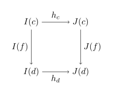
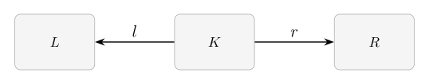
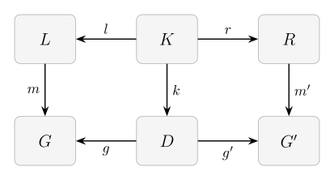
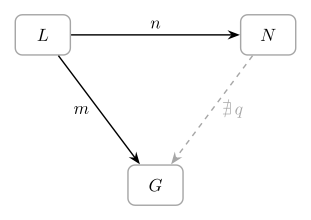
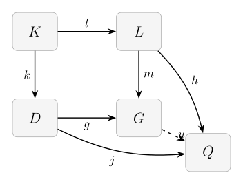

## Setup

```{julia}
using Pkg
Pkg.activate("..")

using Catlab, AlgebraicRewriting
using RewriteGames
using Random
using Statistics: mean
using Catlab.Graphics.Graphviz: Attributes, Statement, Node
import Catlab.Graphics.Graphviz
```

---

## Overview

Reinforcement learning (RL) provides a powerful paradigm for discovering optimal
strategies in games. However, RL is inherently data-hungry: it requires a 
game engine capable of generating millions of play examples. 
For games still under active development, building a bespoke, performant 
simulator from scratch is often a significant engineering barrier. If the rules 
or the board structure change next week, a simulator written in imperative code 
could require a total refactor.

**RewriteGames.jl** is designed to lower the barrier to training RL agents on games by providing a universal 
engine for game simulation. Instead of writing custom state-transition logic in 
imperative code, you define your game in terms of **structured relational data**. 
Game states are represented as in-memory relational databases with a fixed 
schema, and moves are defined as **rewrite rules** that perform 
pattern-matching and replacement on those structures. Any game whose state 
can be described as a relational structure — whether it involves boards, unit 
networks, or abstract graphs — can be simulated immediately. For games that 
share this common relational substrate, RewriteGames.jl's engine's bookkeeping (match 
enumeration, turn sequencing, serialization) applies uniformly.

Two longer-term goals shape the library's design:

- **Modular Game Evolution.** Because the engine operates on relational data, 
  games become "algebraic": you can build a complex game by gluing together 
  simpler ones. You might start with a simple grid-based board and later 
  seamlessly add new types of pieces or network connections without throwing 
  away your existing rules or schedules.
- **Cross-Game Transfer.** When games share a common relational representation, 
  a policy trained on one game could, in principle, transfer to another with 
  a similar structure. This is ongoing research.

In this tutorial, we use **tic-tac-toe** to provide a comprehensive 
introduction to the framework and its underlying theory. We will bridge the gap 
between game design and category theoretic methods that underpin RewriteGames.jl, introducing each concept—from data 
modelling to rewrite logic—exactly when we need it to build our game.

1. **Relational Modelling:** We define the "schema" and instances of the board—its objects 
   and the relationships between them—using Attributed C-Sets (ACSets).
2. **Move Logic:** We define moves as structural changes using rewrite rules 
   and pattern-matching (homomorphisms).
3. **Strategic Symmetry:** We use Data Migrations to mechanically derive O's 
   logic from X's, ensuring perfect symmetry while avoiding code duplication.
4. **Game Flow:** We organize rules and win-checks into a complete, branching 
   game loop using Wiring Diagrams.
5. **Learning:** We train a policy that learns to play directly from the 
   board's relational structure using Graph Neural Networks.

---

## Part 1 — Relational Modelling of the Board

To build a simulator for games under development, we need a data model that is 
both generic and well-behaved. Traditional imperative approaches often fix the 
board as a flat array or a custom struct, making it difficult to reason about 
structural changes or to reuse logic across different games.

Instead, we use **relational modelling**. A relational structure treats the 
game state as a collection of entities (objects) and the relationships 
(morphisms) between them. This approach is powerful because it admits a 
rigorous notion of "relationships between instances", allowing us to find 
sub-patterns, compare states, and transform structures using a unified logic.

### Schema design

Every relational model begins with a **schema**. The schema defines the 
"types" of things that can exist in our world and the "rules" for how they 
connect. For tic-tac-toe, we need to track squares, pieces, and the 
connectivity of the board:

| Object   | Meaning |
|----------|---------|
| `Sq`     | Board squares (always exactly 9) |
| `RowE`   | Horizontal edges encoding row adjacency |
| `ColE`   | Vertical edges encoding column adjacency |
| `DiagE`  | Diagonal edges encoding diagonal adjacency |
| `X`      | X pieces placed so far |
| `O`      | O pieces placed so far |

Two foreign keys (`xsq`, `osq`) record which square each piece occupies.
Each of the three edge tables has two foreign keys recording its source and
target squares (`rsrc`/`rtgt`, `csrc`/`ctgt`, `dsrc`/`dtgt`), giving six
edge-related foreign keys in total. As we will see later, separating rows, columns, and diagonals
into distinct tables lets win-detection patterns repeat across orientations. 
Let's look at how we implement this schema in RewriteGames.jl, or more accurately how RewriteGames.jl uses Catlab.jl and ACSets.jl to do so.

```{julia}
#| label: schema
#| output: true
@present SchTTT(FreeSchema) begin
    Sq::Ob; RowE::Ob; ColE::Ob; DiagE::Ob; X::Ob; O::Ob
    xsq::Hom(X, Sq); osq::Hom(O, Sq)
    rsrc::Hom(RowE, Sq); rtgt::Hom(RowE, Sq)
    csrc::Hom(ColE, Sq); ctgt::Hom(ColE, Sq)
    dsrc::Hom(DiagE, Sq); dtgt::Hom(DiagE, Sq)
    SquareNum::AttrType
    num::Attr(Sq, SquareNum)
end

@acset_type TicTacToe(SchTTT, index=[:xsq, :osq])
const TTT = TicTacToe{Int}
𝒞 = ACSetCategory(VarACSetCat(TTT()))

to_graphviz(SchTTT; prog="dot")
```

### Formalizing the Instance: ACSets as Copresheaves

While the code above looks like a standard database declaration, it has a 
precise mathematical foundation that enables the "algebraic" nature of 
RewriteGames.jl. 

A schema is formally a **category** $\mathbf{C}$. A category consists of:

- A collection of **objects** (e.g., `Sq`, `X`, `RowE`, `ColE`, `DiagE`).
- For each pair of objects $c, d$, a collection of **morphisms** $f: c \to d$ 
  (e.g., `xsq`, `rsrc`, `csrc`, `dsrc`).
- A **composition** law: given $f: c \to d$ and $g: d \to e$, there is a 
  morphism $g \circ f: c \to e$.
- An **identity** morphism $id_c: c \to c$ for every object $c$.

In our context, objects represent the tables of our relational model, and 
morphisms represent the foreign key relationships between them.

An **instance** of that schema (a specific board state) is a **copresheaf**: 
a functor $I: \mathbf{C} \to \mathbf{Set}$.

- For each object $c \in \mathbf{C}$, the functor assigns a set $I(c)$ of 
  elements (the rows in a table).
- For each morphism $f: c \to d$ in $\mathbf{C}$, the functor assigns a 
  function $I(f): I(c) \to I(d)$ (the foreign key mappings).

This is exactly what we call a **C-Set**. Strictly speaking, to handle 
**attributes** (like the square number `num`), we extend this definition to 
an "Attributed C-Set" (ACSet), which is more involved. 
For the remainder of this tutorial, however, we will 
elide this technical distinction and treat our game states simply as 
copresheaves.

By treating game states as functors, we gain access to the rich toolbox of 
category theory, including the ability to relate different states to one 
another. First, however, we're going to make some Julia functions that construct
an instance of our TicTacToe schema.

### Board constructor and visualisation

Squares are numbered 1–9 in row-major order. Horizontal edges connect 
adjacent squares in the same row; vertical edges connect squares directly 
above/below each other.

```{julia}
#| label: constructor
function create_board()
    ttt = TTT()
    add_parts!(ttt, :Sq, 9; num=collect(1:9))

    # Row edges (bidirectional)
    for i in 0:2, j in 0:1
        s, t = 3*i+j+1, 3*i+j+2
        add_parts!(ttt, :RowE, 2, rsrc=[s, t], rtgt=[t, s])
    end

    # Column edges (bidirectional)
    for i in 0:1, j in 0:2
        s, t = 3*i+j+1, 3*i+j+1+3
        add_parts!(ttt, :ColE, 2, csrc=[s, t], ctgt=[t, s])
    end

    # Diagonal edges (bidirectional)
    # Main diagonal: 1-5, 5-9
    for (s, t) in [(1,5), (5,9)]
        add_parts!(ttt, :DiagE, 2, dsrc=[s, t], dtgt=[t, s])
    end
    # Anti-diagonal: 3-5, 5-7
    for (s, t) in [(3,5), (5,7)]
        add_parts!(ttt, :DiagE, 2, dsrc=[s, t], dtgt=[t, s])
    end

    return ttt
end
```

To understand this code in terms of our copresheaf definition:

1.  `TTT()` initializes an empty instance—a functor $I$ that maps every object 
    in $\mathbf{C}$ to the empty set.
2.  `add_parts!(ttt, :Sq, 9)` defines the set $I(Sq)$ to be a set of 9 
    elements.
3.  `add_parts!(ttt, :RowE, 2, rsrc=[s, t], rtgt=[t, s])` adds elements to 
    the set $I(RowE)$ and defines where the functions $I(rsrc)$ and 
    $I(rtgt)$ map those elements within the set $I(Sq)$.

By the end of the constructor, we have a fully specified functor representing 
the initial state of a 3x3 tic-tac-toe board, with its row, column, and 
diagonal adjacency captured in distinct tables.

A small Graphviz helper renders any board state for quick inspection:

```{julia}
#| label: view-board
#| output: true
function view_TTT(p::TTT)
    stmts = Statement[]
    for s in parts(p, :Sq)
        n   = let v = subpart(p, s, :num); v isa Integer ? v : s end
        row = div(n-1, 3)
        col = mod(n-1, 3)
        x, y = col, 2-row
        label = ""
        xs = incident(p, s, :xsq)
        os = incident(p, s, :osq)
        if !isempty(xs)
            label = "X"
        elseif !isempty(os)
            label = "O"
        end
        push!(stmts, Node("v$s", Attributes(
            :label => label,
            :shape => "square",
            :width => "0.5",
            :height => "0.5",
            :pos => "$(x),$(y)!",
            :fixedsize => "true"
        )))
    end
    Graphviz.Digraph("TTT", stmts; prog="neato")
end

view_TTT(create_board())
```

### Relating Instances: Morphisms and Natural Transformations

The "killer feature" of using copresheaves is that there is a canonical way 
to define a map between two board states. A **morphism** (or homomorphism) 
$h: I \to J$ between two ACSets is a **natural transformation**.

Formally, a natural transformation $h: I \to J$ between two functors 
$I, J: \mathbf{C} \to \mathbf{Set}$ is a family of functions 
$\{h_c: I(c) \to J(c)\}_{c \in \mathbf{C}}$ (one for each object in our 
schema) such that for every morphism $f: c \to d$ in $\mathbf{C}$ (every 
foreign key), the following diagram commutes:

{#fig-naturality}

In plain English, this commutativity means that the mapping $h$ **preserves 
structure**. If we map an element from one table to another, all of its 
relationships (foreign keys) must be preserved in the target instance.

#### Example: Mapping a Square to a Piece

Consider a simple homomorphism from a bare square to a square that contains 
an 'X'. We can define these two instances and find the morphism between them:

```{julia}
#| label: example-hom
#| output: true
# Define a bare square instance
bare_sq = TTT()
add_parts!(bare_sq, :Sq, 1; num=[1])

# Define a square with an X piece
sq_with_x = TTT()
add_parts!(sq_with_x, :Sq, 1; num=[1])
add_parts!(sq_with_x, :X, 1; xsq=[1])

# Find the structural mapping (homomorphism)
h = homomorphism(bare_sq, sq_with_x; cat=𝒞)

println("Homomorphism components:")
for (ob, func) in pairs(components(h))
    # We only print components for objects with elements in the domain
    if nparts(bare_sq, ob) > 0
        println("  $ob: $([func(i) for i in 1:nparts(bare_sq, ob)])")
    else
        println("  $ob: []")
    end
end
```

The component for `Sq` maps our single square in `bare_sq` to the single 
square in `sq_with_x`. Because `bare_sq` has no pieces, the components for 
`X`, `O`, and `E` are empty functions.

We can visualize the source and target of this morphism:

```{julia}
#| label: view-hom-source
#| output: true
view_TTT(bare_sq)
```

```{julia}
#| label: view-hom-target
#| output: true
view_TTT(sq_with_x)
```

This structural consistency is what allows us to define "patterns." Finding 
a winning line or checking if a square is empty is simply a matter of 
searching for a morphism from a small pattern ACSet into the large board 
ACSet. This leads us directly into the next portion of defining a game: 
using these morphisms to perform **Rewrite Rules**.

---

## Part 2 — Rewrite Rules

Everything a player can do in a game — place a piece, move a unit, build a 
structure — is represented in RewriteGames.jl as an **algebraic rewrite 
rule**. Before we implement these rules, we need to understand the formal 
machinery that makes them work: **Double Pushout (DPO) Rewriting**.

### The Anatomy of a Rule: Spans

A rewrite rule is defined by a **span** of ACSets $L \leftarrow K \to R$. 
Each piece of this span has a specific semantic role:

- **$L$ (Left Pattern):** The sub-structure that must be present in the world 
  for the rule to fire. It defines *what* we are looking for.
- **$K$ (Interface):** The part of the pattern that is **preserved** during 
  the rewrite. It acts as the anchor that connects the old world to the new.
- **$R$ (Right Pattern):** What the sub-structure looks like *after* the 
  rewrite.

{#fig-span-placeholder}

As a concrete illustration, consider the `mark_x` rule that places an X on an empty square:

- **$L = K$:** A single bare Sq. The left leg $l = id_{Sq}$ is an isomorphism, so nothing in the world is deleted — we are simply locating a square to mark.
- **$R$:** The Sq-with-X representable. The right leg $r: Sq \to X$ embeds the bare square into a structure that also holds an X piece, adding the piece to the matched square.

@fig-mark-x-span shows the same span with each ACSets replaced by its **category of elements**: every table row becomes a node and every foreign-key application becomes an edge. The color encoding reveals the action of the span morphisms — blue nodes appear in the image of $l$ or $r$ from $K$, while the orange X node is freshly introduced by $r$ with no preimage in $K$.

{#fig-mark-x-span}

### Matching and the DPO Diagram

To apply a rule to our game board $G$, we first find a **match**: a 
homomorphism $m: L \to G$. This match identifies a specific location on the 
board where the pattern $L$ exists.

The rewrite process is then governed by the following commutative diagram 
consisting of two **pushout** squares:

{#fig-dpo-diagram}


Each element of the diagram has a concrete role:

| Symbol | Role | For `mark_x` |
|--------|------|--------------|
| $L$ | Left pattern — the sub-structure to find | A single bare square |
| $K$ | Interface — what is preserved | The same bare square |
| $R$ | Right pattern — the replacement | A square with an X piece |
| $G$ | Current world | The 3×3 board before the move |
| $D$ | Pushout complement — the residual world | The board unchanged (nothing is deleted) |
| $G'$ | New world | The board after the X is placed |

The morphisms stitch the objects together: $l$ and $r$ are the span legs; $m: L \to G$ is the **match** (identifying where in $G$ the pattern appears); $k: K \to D$ tracks the preserved interface into the residual world; and $g$, $g'$, $m'$ complete the two pushout squares.

### Finding the Match

The first computational step is finding the match $m: L \to G$ — a
homomorphism from the left pattern into the current world.

Recall that a homomorphism is a structure-preserving map: it must send every
table row of $L$ to a row of the same table in $G$, and it must respect every
foreign key. If $L$ records a row-edge from square $a$ to square $b$, then
$m(a)$ and $m(b)$ must also be connected by a row-edge in $G$.

For `mark_x`, $L$ is a single bare square with no edges, so the only constraint
is that the target is a square. @fig-hom-search shows one particular match $m$:
$L$'s Sq is sent to the center square of $G$ (highlighted in bright blue). The
eight remaining squares (light blue) are valid alternative targets — on an empty
board any of the nine squares could serve as the match. Narrowing the candidate
set to only empty squares is the job of **Negative Application Conditions
(NACs)**, described in the next section.

{#fig-hom-search}

### Negative Application Conditions

Finding all homomorphisms $m: L \to G$ gives the raw candidate matches. A
**Negative Application Condition (NAC)** prunes that set by declaring a match
*invalid* whenever the matched sub-graph can be extended into a larger forbidden
pattern.

Formally, a NAC is a morphism $n: L \to N$. A match $m: L \to G$ is *rejected*
by this NAC if there exists any morphism $q: N \to G$ that makes the triangle
commute — that is, if $q \circ n = m$.

{#fig-nac-triangle}

Think of it as a "forbidden extension": the match is legal only when the
matched sub-structure in $G$ *cannot* be extended into the pattern $N$.

For `mark_x`, we attach two NACs:

1. **"Not already an X":** $n: Sq \to X$ — reject the match if the square already holds an X piece.
2. **"Not already an O":** $n: Sq \to O$ — reject the match if the square already holds an O piece.

Together these ensure `mark_x` can only fire on a genuinely empty square,
which is exactly the legality condition for a Tic-Tac-Toe move.

### What is a Pushout?

Formally, a **pushout** of two morphisms $l: K \to L$ and $k: K \to D$ consists
of an object $G$ and two morphisms $m: L \to G$ and $g: D \to G$ such that
$m \circ l = g \circ k$.

Furthermore, it must satisfy the **universal property**: for any other object
$Q$ and morphisms $h: L \to Q$ and $j: D \to Q$ such that $h \circ l = j \circ k$,
there exists a unique morphism $u: G \to Q$ such that $u \circ m = h$ and
$u \circ g = j$.

{#fig-pushout-universal}

In the context of ACSets, this means taking the disjoint union of the
elements in $L$ and $D$, and then identifying (merging) any elements that
came from the same element in $K$.

#### Intuition: The "Minimal" Glue

The universal property might look abstract, but it provides a critical
guarantee: it ensures that the pushout is the
**minimal** object that combines $L$ and $D$ along $K$.

-   **No extra elements:** The property ensures we haven't added any
    "ghost" squares or pieces that weren't in $L$ or $D$.
-   **No unnecessary merges:** It ensures we haven't "squashed" any
    distinct parts of the board together unless they were explicitly linked
    by the interface $K$.

In short, the universal property is our algebraic guarantee that the rewrite
performs **exactly** the specified replacement and nothing more.

### Computing the Pushout Complement

With the pushout defined, we can now describe the first computational step of
a DPO rewrite: finding the **pushout complement** $D$.

Given the match $m: L \to G$ and the left leg $l: K \to L$, the pushout
complement is the unique ACSets $D$ — together with morphisms $k: K \to D$ and
$g: D \to G$ — such that the left square of the DPO diagram is a pushout.
Intuitively, $D$ is $G$ with the elements that were matched by $L$ but are
*not* in the interface $K$ removed. It is the "residual world" that persists
through the rewrite.

@fig-pushout-example shows this setup for the `mark_x` rule on an empty board.
$G$ (bottom-left) is the full 3×3 board: nine Sq nodes connected by row, column,
and diagonal adjacency edges. The darker blue square is the one targeted by the
match $m$. Because $l: K \to L$ is an isomorphism for this rule — nothing is
deleted — the pushout complement $D$ (bottom-right, dashed border) is identical
to $G$. The key morphism $k: K \to D$ embeds the interface square into $D$ at
the same position selected by the match.

{#fig-pushout-example}

### The DPO Rewrite Process

We are now ready to understand a full DPO rewrite step.

1.  **Game Design (The Span):** The designer defines a span $L \leftarrow K \to R$.
    This is a static declaration of what a move looks like in principle.
2.  **Match Search (Finding $m$):** During gameplay, the engine searches for
    **homomorphisms** $m: L \to G$. These represent the legal "spots" on the
    current board where the rule could be applied.
3.  **Pushout Complement (Finding $D$):** Once a match is chosen, the engine
    computes $D$ as described above — the board with the matched-but-not-preserved
    elements removed.
4.  **The Result (The RHS Pushout $G'$):** The engine computes a second pushout,
    gluing the new pattern $R$ onto $D$ along the shared interface $K$. This
    produces the updated world $G'$.

@fig-dpo-markx shows the complete DPO rewrite for the `mark_x` rule applied
to the center square of an empty board. Each object is its category of elements:
blue circles are Sq nodes (bright = in the image of a morphism from $K$; light
= elsewhere on the board), and the orange circle is the new X piece glued in by
the right pushout. Gray lines are board topology edges (RowE, ColE, DiagE).

{#fig-dpo-markx}

By using this formal approach, RewriteGames.jl ensures that all state
transitions are structurally consistent. Defining the game rules as rewrite
rules means that agents can only ever take legal actions that are available
given the state of the board. The algebraic machinery handles the "logic"
of the physical board automatically.

### Theory to Practice: Building X's Rules

For our TicTacToe game, we will build X's rules first. Once those are in 
place, the **Strategic Symmetry** section shows how a single migration 
functor derives O's entire ruleset — including move rules, win-detection 
rules, and schedule structure — without writing any additional rule code. 
Another advantage of algebraic modeling!

Before we write rules, it will be convenient to have the Yoneda 
representables and the `Names` object that AlgebraicRewriting uses to 
construct and label morphisms:

```{julia}
#| label: yoneda
gSq, gRE, gCE, gDE, gX, gO = ob_generators(FinCat(SchTTT))
yTTT = yoneda_cache(TTT; clear=true)
I  = TTT()          # the empty ACSet (initial object)
Sq = ob_map(yTTT, gSq)
RowE = ob_map(yTTT, gRE)
ColE = ob_map(yTTT, gCE)
DiagE = ob_map(yTTT, gDE)
X  = ob_map(yTTT, gX)
O  = ob_map(yTTT, gO)
N  = Names(Dict("X" => X, "O" => O, "Sq" => Sq, "" => I, "I" => I))
```


The representable for each schema object is the unique (up to isomorphism) ACSet with
exactly one element of that type, plus the minimum number of elements of every other type
required to satisfy the foreign-key constraints.  Think of it as the "atom" for that type.

| Variable | Object  | `Sq` | `RowE` | `ColE` | `DiagE` | `X` | `O` | Description |
|----------|---------|------|--------|--------|---------|-----|-----|-------------|
| `Sq`     | `Sq`    | 1    | 0      | 0      | 0       | 0   | 0   | A single bare square |
| `RowE`   | `RowE`  | 2    | 1      | 0      | 0       | 0   | 0   | Two squares joined by one row edge |
| `ColE`   | `ColE`  | 2    | 0      | 1      | 0       | 0   | 0   | Two squares joined by one column edge |
| `DiagE`  | `DiagE` | 2    | 0      | 0      | 1       | 0   | 0   | Two squares joined by one diagonal edge |
| `X`      | `X`     | 1    | 0      | 0      | 0       | 1   | 0   | One X piece on one square |
| `O`      | `O`     | 1    | 0      | 0      | 0       | 0   | 1   | One O piece on one square |

The representables for `X` and `O` look like single-square boards with a piece already placed:

```{julia}
#| label: view-x-rep
#| output: true
view_TTT(X)   # representable for X: one square with an X piece
```

```{julia}
#| label: view-o-rep
#| output: true
view_TTT(O)   # representable for O: one square with an O piece
```

`yoneda_cache` computes all representables once and caches them.
`Names` maps human-readable strings to representables; `mk_sched` and `view_sched` use it
to label wires in the wiring diagram.

### The `mark_x` rule

With the theory in place, the implementation is direct. `L = K` is the bare
square representable `Sq`; the left leg is the identity (nothing deleted) and
the right leg embeds `Sq` into `X` (adding the piece). The two NACs block
firing on already-occupied squares.

```{julia}
#| label: view-span-L
#| output: true
view_TTT(Sq)   # L = K
```

```{julia}
#| label: view-span-R
#| output: true
view_TTT(X)    # R
```

```{julia}
#| label: mark-x-rule
id_Sq    = id[𝒞](Sq)
mark_X_l = id_Sq
mark_X_r = homomorphism(Sq, X; cat=𝒞)

mark_x = Rule(mark_X_l, mark_X_r; monic=true,
              ac=[NAC(homomorphism(Sq, X; cat=𝒞)),
                  NAC(homomorphism(Sq, O; cat=𝒞))])
```

### Strategic Symmetry: From X to O

We have now defined the fundamental move for the X player. Because we have modelled our game as a relational structure on a 
schema, we can take advantage of the inherent **symmetry** of tic-tac-toe. 
The rules for O are structurally identical to the rules for X; they simply 
operate on different tables. 

#### The X ↔ O symmetry

Tic-tac-toe is symmetric between X and O in everything except turn order. 
Both players have the same move type (mark an empty square), and both have 
the same win condition (three in a row). Any rule built for X can be 
mechanically converted to its O counterpart by swapping every occurrence 
of `X` for `O`, `xsq` for `osq`, and vice versa.

Doing this swap by hand is tedious and error-prone. AlgebraicJulia provides 
a better tool: the **Data Migration**.

#### The `Migrate` functor in AlgebraicJulia

A **Data Migration** encodes a schema morphism as a Julia object that can 
be applied to any ACSet instance, ACSet morphism, or even an entire 
rewrite rule. Formally, this is the **pullback migration** (often denoted 
$\Delta_F$) developed by David Spivak in the context of functorial data 
migration.

Given a functor $F: \mathbf{S} \to \mathbf{T}$ between two schemas (viewed 
as categories), the migration functor $\Delta_F: \mathbf{Set}^\mathbf{T} \to \mathbf{Set}^\mathbf{S}$ 
is defined by **precomposition**. If $X: \mathbf{T} \to \mathbf{Set}$ is an 
instance of schema $\mathbf{T}$, then its migrated instance $\Delta_F(X)$ is the 
composite functor:

$$\Delta_F(X) = X \circ F$$

Concretely, this means:
-   **On Elements:** The set of elements for an object $s \in \mathbf{S}$ in 
    the new instance is simply the set of elements of $F(s)$ in the original 
    instance: $(\Delta_F(X))(s) = X(F(s))$.
-   **On Relationships:** For any morphism $f: s \to s'$ in $\mathbf{S}$, 
    the new mapping is the original mapping of its image under $F$: 
    $(\Delta_F(X))(f) = X(F(f))$.

In our case, both the source and target schema are `SchTTT`, but we define 
a non-trivial self-map of the schema that swaps $X \leftrightarrow O$ and 
$xsq \leftrightarrow osq$ while leaving the board topology ($Sq$, $E$, 
$src$, $tgt$) unchanged. By applying $\Delta_F$, we effectively "rename" 
the tables and columns of our board according to the symmetry we defined.

```{julia}
#| label: migration-functor
F = Migrate(
    𝒞,
    Dict(:X => :O, :O => :X, :Sq => :Sq, :RowE => :RowE, :ColE => :ColE, :DiagE => :DiagE, :SquareNum => :SquareNum),
    Dict(:xsq => :osq, :osq => :xsq, :rsrc => :rsrc, :rtgt => :rtgt, :csrc => :csrc, :ctgt => :ctgt, :dsrc => :dsrc, :dtgt => :dtgt, :num => :num),
    SchTTT, TTT)
```

The first `Dict` maps **objects** (tables) and the second maps **morphisms** 
(foreign keys). Once `F` is built, you can apply it to:

- **ACSet instances**: `F(board)` returns a new board with all X pieces 
  turned into O pieces and vice versa.
- **ACSet morphisms**: `F(h)` pushes a homomorphism forward through the 
  schema map.
- **Rules**: `F(rule)` migrates the left pattern, the right pattern, the 
  interface, and every application condition (NAC) of the rule.

This single functor definition is all we need to derive O's entire ruleset 
from X's without repeating any code. We will see this in action once we 
organize our rules into a schedule.

### Win-detection rules

Now that we have a strategy for handling player-specific moves, we need to 
think about the **neutral rules** of the game—those that don't represent 
a player's choice but rather the "physics" or "logic" of the game itself. 
The most important of these is win detection.

Rather than enumerating all eight winning lines explicitly, we describe a 
single winning configuration structurally: three squares connected by two 
successive row edges. We then use **Data Migrations** to derive the 
column and diagonal win conditions for free.

```{julia}
#| label: win-patterns
# Base pattern: three squares connected by row edges, all marked X
row_structural = TTT()
add_parts!(row_structural, :SquareNum, 3)
add_parts!(row_structural, :Sq, 3; num=AttrVar.(1:3))
add_parts!(row_structural, :RowE, 2, rsrc=[1,2], rtgt=[2,3])
for i in 1:3; add_part!(row_structural, :X, xsq=i); end

# Define migrations to swap RowE with ColE and DiagE
F_row2col = Migrate(𝒞, 
    Dict(:X=>:X, :O=>:O, :Sq=>:Sq, :RowE=>:ColE, :ColE=>:RowE, :DiagE=>:DiagE, :SquareNum=>:SquareNum),
    Dict(:xsq=>:xsq, :osq=>:osq, :rsrc=>:csrc, :rtgt=>:ctgt, :csrc=>:rsrc, :ctgt=>:rtgt, :dsrc=>:dsrc, :dtgt=>:dtgt, :num=>:num),
    SchTTT, TTT)

F_row2diag = Migrate(𝒞, 
    Dict(:X=>:X, :O=>:O, :Sq=>:Sq, :RowE=>:DiagE, :DiagE=>:RowE, :ColE=>:ColE, :SquareNum=>:SquareNum),
    Dict(:xsq=>:xsq, :osq=>:osq, :rsrc=>:dsrc, :rtgt=>:dtgt, :dsrc=>:rsrc, :dtgt=>:rtgt, :csrc=>:csrc, :ctgt=>:ctgt, :num=>:num),
    SchTTT, TTT)
```

Each pattern becomes a no-op rule; injective (`monic=true`) matching ensures 
distinct pattern squares always map to distinct board squares, preventing 
spurious wins.

```{julia}
#| label: win-rules
x_rows_rule  = Rule(id[𝒞](row_structural), id[𝒞](row_structural); monic=true)
# Derive other win rules via migration!
x_cols_rule  = F_row2col(x_rows_rule)
x_diags_rule = F_row2diag(x_rows_rule)

x_rows_app  = RuleApp(:x_wins_rows,  x_rows_rule,  I; cat=𝒞)
x_cols_app  = RuleApp(:x_wins_cols,  x_cols_rule,  I; cat=𝒞)
x_diags_app = RuleApp(:x_wins_diags, x_diags_rule, I; cat=𝒞)
```

### Taking Stock: From Rules to Gameplay

We have now implemented everything we need to describe the **logic** of 
tic-tac-toe:

1.  **X's moves:** Defined as rewrite rules with NACs.
2.  **O's moves:** Derived via the `Migrate` functor.
3.  **Win conditions:** Defined as structural patterns (no-op rules).

However, we are still missing the **flow** of the game. We haven't yet 
specified whose turn it is, what happens after a move is made, or when the 
game should officially stop. For this, we need to arrange our rules into a 
**schedule**.

---

## Part 3 — Building the Schedules

With moves defined as rewrite rules, the next step is to arrange them into a *schedule*:
a wiring diagram that specifies whose turn it is, what happens when a win condition is
met, and how play loops from round to round.  A schedule is itself a composable object —
sub-schedules for individual players can be defined independently and then wired together
into a full game loop.

Two RewriteGames primitives build on AlgebraicRewriting's scheduling machinery:

- **`PlayerRuleApp`** wraps a `Rule` and tags it with a player identity.  When execution
  reaches this box the engine asks the player to choose a move rather than
  applying one automatically.
- **`GameSched`** is a schedule with extra bookkeeping: it tracks which boxes belong to
  which player and retains enough information to rebuild the schedule after a schema
  migration.

### `RuleApp` and its two output ports

Before introducing `PlayerRuleApp`, it helps to understand the simpler primitive it
extends: `RuleApp`.

A `RuleApp` wraps a `Rule` into a *schedulable box*.  When execution reaches a `RuleApp`
the engine applies the rule automatically — it finds a match on its own (or signals
failure when none exists) — **without consulting any player or agent**.  This makes
`RuleApp` appropriate for mechanical checks such as win detection, where there is no
decision to be made.

The key property of every `RuleApp` (and `PlayerRuleApp`) is **two output ports**:

- **Port 1** (success): carries the rewritten world when a match was found and the rule
  applied.
- **Port 2** (failure): carries the original world unchanged when no match existed.

This two-port structure lets schedules branch based on whether a rule could fire — which
is exactly what we need for win detection and tie detection.

### `PlayerRuleApp` — tagging a rule with a player

`PlayerRuleApp` extends `RuleApp` by tagging the rule with a *player identity*:

```julia
mark_x_app = PlayerRuleApp(:mark_x, mark_x, I, :X; cat=𝒞)
```

Arguments:
- `:mark_x` — the display name used by `view_sched` and stored in `Action` records.
- `mark_x` — the AlgebraicRewriting `Rule`.
- `I` — the interface ACSet (same role as the third argument to `RuleApp`).
- `:X` — the player key; must match a key in the `agents` dict passed to
  `run_game_sched!`.

The `:X` tag is the **player key** that links this box to a concrete agent at runtime.
When you call `run_game_sched!`, you pass an `agents` dictionary mapping player keys to
`AbstractAgent` values — for example `Dict(:X => FunctionAgent(...), :O => FunctionAgent(...))`.
Every `PlayerRuleApp` consults that dictionary to find the right agent for its player
key. We will see exactly how to construct and register agents in Part 4.

When `run_game_sched!` reaches a `PlayerRuleApp` box, it enumerates all valid matches
(legal moves), presents them to the registered agent, applies the chosen match, and
records an `Experience` capturing the board before and after the move.

Like a plain `RuleApp`, a `PlayerRuleApp` has two output ports: **success** (a move was
made) and **failure** (no legal moves exist). If no matches exist (board full), the box routes to its failure
port, signalling a tie.

Agents can also **pass voluntarily**: returning `nothing` from `select_action` when matches
are available routes to the same failure port with the world left unchanged, and records
`action = nothing` in the `Experience`.  The transcript loop below uses exactly this check
(`exp.action !== nothing`) to distinguish a real move from a pass or no-match turn.


The sub-schedules below are built with `mk_game_sched`.  Read each code block as a
**dataflow program**: every assignment `out1, out2 = box(in)` runs `box` on whatever
board is currently flowing along wire `in` and routes the result to `out1` (success) or
`out2` (failure).  A full reference for `mk_game_sched` and its DSL appears in the
next subsection, after you have seen all three component schedules.

### Win-check sub-schedules

`x_won_check_gs` succeeds (port 1) when X has three in a row, fails (port 2) otherwise.
It uses only plain `RuleApp` boxes — no player decisions — so execution is deterministic.
The three orientations (rows, columns, diagonals) are tested in cascade; two `merge_wires` boxes collect the three
success paths into a single `won` exit wire.

```{julia}
#| label: x-won-check
x_won_check_gs = mk_game_sched((;), (init=:I,), N,
    (r=x_rows_app, c=x_cols_app, d=x_diags_app, mw=merge_wires(I)),
    quote
        won_r, not_r = r(init)
        won_c, not_c = c(not_r)
        won_d, not_d = d(not_c)
        won_rc = mw(won_r, won_c)
        won    = mw(won_rc, won_d)
        return won, not_d
    end)
```

```{julia}
#| output: true
view_sched(x_won_check_gs; names=N)
```

### X's turn schedule

`mark_x_app` is a `PlayerRuleApp` tagged `:X`.  Port 1 fires after a successful mark;
port 2 fires if no empty square exists (tie).  Win detection is handled separately by
the outer game loop, so this sub-schedule has only two return wires.

```{julia}
#| label: x-sched
mark_x_app = PlayerRuleApp(:mark_x, mark_x, I, :X; cat=𝒞)

X_sched_gs = mk_game_sched((;), (init=:I,), N,
    (mx=mark_x_app,),
    quote
        moved, tie = mx(init)
        return moved, tie
    end)
```

```{julia}
#| output: true
view_sched(X_sched_gs; names=N)
```

The schedule has two return wires:

- `moved` — X placed a piece; pass the updated board to the win check.
- `tie` — board was full when X tried to move; exit as draw.

### Migrating to O's schedule with `player_migrate`

`player_migrate` applies the schema functor `F` to every box in a `GameSched` and
remaps player identities:

```julia
player_migrate(F, gs::GameSched, player_map::Dict{Symbol,Symbol}) -> GameSched
```

It traverses all boxes recursively:

- **`PlayerRuleApp`**: the rule and interface are migrated (`F(v.rule)`, `F(v.init)`),
  the player key is remapped, and the display name is updated via the optional `name_map`
  keyword argument.
- **`GameSched`**: migrated recursively.
- **Other boxes** (`RuleApp`, `merge_wires`): migrated via `F(box)`.

The rebuilt schedule has the same wiring topology but with all X patterns swapped for O
patterns throughout.

```{julia}
#| label: o-sched
O_sched_gs = player_migrate(F, X_sched_gs, Dict(:X => :O); name_map=Dict(:mark_x => :mark_o))
```

```{julia}
#| output: true
view_sched(O_sched_gs; names=N)
```

The `name_map` argument renames the `:mark_x` box to `:mark_o` in the migrated schedule.
The functional difference is entirely in the rules: the mark rule's right-hand side now
adds an `O` piece, and the `PlayerRuleApp` player tag has been updated from `:X` to `:O`.

We also derive O's win-check sub-schedule via the same migration:

```{julia}
#| label: o-win-check
o_won_check_gs = player_migrate(F, x_won_check_gs, Dict(:X => :O);
    name_map=Dict(:x_wins_rows => :o_wins_rows, :x_wins_cols => :o_wins_cols, :x_wins_diags => :o_wins_diags))
```

### `GameSched` and `mk_game_sched` — the scheduling DSL

Now that you have seen three concrete schedules, it is easier to understand the
primitives that build them.

#### Wires and boxes

Think of a schedule as a **wiring diagram**: named wires carry a board (an ACSet) from
one box to the next.  At any moment exactly one wire is *active* (carrying a board);
all others are `nothing`.  A box receives the board on its input wire, does something
with it, and routes the result to one of its output wires:

- A `RuleApp` box fires its rule automatically and routes to port 1 (success) or port 2
  (no match found).
- A `PlayerRuleApp` box pauses, asks its agent to pick a move, applies it, and routes
  to port 1 (moved) or port 2 (no legal moves — tie).
- A `merge_wires` box forwards the first active (non-`nothing`) input wire and discards
  the rest — a convenient fan-in node.

#### Loops and the `trace_arg`

A schedule can loop by declaring **trace wires**: return wires that feed back into the
start of the next iteration.  The first `length(trace_args)` wires in the `return`
statement are loop-back wires; any remaining wires are exit wires that terminate the
schedule.

For example, `game_sched` declares `(trace_arg=:I,)` as its trace wire and
`(init=:I,)` as its one-time initialisation wire:

- On the **first iteration**, `[init, trace_arg]` routes `init` (the freshly created
  board) into X's turn, because `trace_arg` is still `nothing`.
- On **subsequent iterations**, the board returned on `o_cont` feeds back as
  `trace_arg`, while `init` is now `nothing`.

This pattern — `[init, trace_arg]` as the input — is the standard idiom for turning a
straight-line schedule into a game loop.

#### Full API

```julia
mk_game_sched(trace_args, init_args, N, boxes, body) -> GameSched
```

- `trace_args` — `NamedTuple` of `Symbol => wire_type` pairs for loop-back wires.
- `init_args`  — `NamedTuple` for wires that are only active on the first iteration.
- `N`          — the `Names` object mapping wire-type labels to representable ACSets.
- `boxes`      — `NamedTuple` of schedulable boxes (`PlayerRuleApp`, `GameSched`,
  `RuleApp`, `merge_wires(I)`, …).
- `body`       — a `quote` block in the wire-assignment DSL:

```julia
quote
    out1, out2 = box_name(in_wire)        # route a single active wire into a box
    merged     = merge_box(out1, out3)    # merge_wires: forward the first active wire
    out3, out4 = box2([wire_a, wire_b])   # [wa, wb]: first active wire enters box
    return trace_wire, exit_wire          # first length(trace_args) wires loop back
end
```

`view_sched(gs; names=N)` renders any `GameSched` as a Graphviz wiring diagram.

### Full game loop

The outer schedule loops X then O, interleaving each player's move with the
corresponding win-check sub-schedule.  If a win check succeeds, the world exits on a
player-specific wire (`x_won` or `o_won`).  If a player has no legal moves the board
exits on the `tie` wire.  Otherwise `o_cont` feeds back for the next round.

```{julia}
#| label: game-sched
game_sched = mk_game_sched(
    (trace_arg=:I,),
    (init=:I,),
    N,
    (x=X_sched_gs, o=O_sched_gs, cx=x_won_check_gs, co=o_won_check_gs, mw=merge_wires(I)),
    quote
        x_moved, x_tie = x([init, trace_arg])
        x_won, x_cont  = cx(x_moved)
        o_moved, o_tie = o(x_cont)
        o_won, o_cont  = co(o_moved)
        tie = mw(x_tie, o_tie)
        return o_cont, x_won, o_won, tie
    end)
```

```{julia}
#| output: true
view_sched(game_sched; names=N)
```

Return wires:

- `o_cont` — trace wire; fed back at the start of the next round.
- `x_won` — X has three in a row; game ends, X wins.
- `o_won` — O has three in a row; game ends, O wins.
- `tie` — neither player could move; game ends as a draw.

---

## Part 4 — Running the Game

With the schedule built, we have a complete description of how tic-tac-toe **works**,
but we still need to say **who** plays.  This section connects the three remaining pieces:

1. **`Game`** — a lightweight metadata record that tells the runner which players
   participate, how to create a fresh board, and which exit wires count as wins, losses,
   or draws.
2. **Agents** — Julia callables (wrapped in `FunctionAgent` or a custom `AbstractAgent`
   subtype) that decide which move to make when the runner asks.
3. **`run_game_sched!`** — the main loop that drives the schedule, asks agents for
   moves, and collects an `Experience` record for every player turn.

Once these are in place, running a single game is a one-liner, and collecting thousands
of episodes for training or statistics is a simple loop.

### `Game` metadata record

`Game` is a lightweight struct that bundles the metadata describing a game:

```julia
struct Game
    players        :: Vector{Symbol}
    initial        :: Function                       # () -> ACSet
    schema         :: Any                            # schema presentation (optional)
    win_conditions :: Union{Dict{Symbol,Any}, Nothing}
end
```

- `players` declares who participates and in what order.
- `initial` is a zero-argument factory called once per episode to produce a fresh world
  ACSet.  Keeping it as a callable (rather than a single ACSet) ensures episodes are
  truly independent.
- `schema` is optional metadata used by `GameMigration`.
- `win_conditions` maps exit wire names to winner identities, resolving the winner from
  the active exit wire when the schedule terminates.  Use `nothing` for draw wires.

### `FunctionAgent` — the simplest agent type

```julia
FunctionAgent((state, actions) -> rand(actions))
```

A `FunctionAgent` wraps any Julia function with signature
`(EncodedState, Vector{Action}) -> Action` into an `AbstractAgent`.  It is the workhorse
for random baselines and hand-coded heuristics.

### `run_game_sched!` and `Experience`

```julia
run_game_sched!(gs::GameSched, game::Game, agents::Dict; T_max=1000)
    -> Vector{Experience}
```

The runner calls `game.initial()` to create the starting world, then drives the
schedule until it exits.  Every `PlayerRuleApp` execution emits one `Experience`:

```julia
struct Experience
    player        :: Symbol
    state         :: GameState               # world before the move
    legal_actions :: Vector{Action}
    action        :: Union{Action, Nothing}  # nothing = no legal moves (tie)
    next_state    :: GameState               # world after the move
    done          :: Bool
    winner        :: Union{Symbol, Nothing}
    info          :: Dict{Symbol, Any}
end
```

### Win conditions and game record

Rather than a Julia callback, the game's termination logic is now expressed entirely by
the exit wires in `game_sched`.  We only need to tell `run_game_sched!` which player
each exit wire belongs to via `win_conditions`:

```{julia}
#| label: game-record
game = Game(SchTTT;
    players        = [:X, :O],
    initial        = create_board,
    win_conditions = Dict{Symbol, Any}(:x_won => :X, :o_won => :O, :tie => nothing))
```

```{julia}
#| label: agents
Random.seed!(42)
agents = Dict{Symbol, AbstractAgent}(
    :X => FunctionAgent((state, actions) -> rand(actions)),
    :O => FunctionAgent((state, actions) -> rand(actions)),
)
```

### Single episode and final board state

```{julia}
#| label: single-episode
#| output: true
Random.seed!(42)
exps = run_game_sched!(game_sched, game, agents; T_max=20)

println("Episode length : ", episode_length(exps))
println("Winner         : ", isempty(exps) ? "N/A" : something(exps[end].winner, "draw"))
println("Done flag      : ", isempty(exps) ? false  : exps[end].done)
```

After the episode, `exps[end].next_state.world` holds the final board ACSet:

```{julia}
#| label: final-board
#| output: true
final_board = exps[end].next_state.world
view_TTT(final_board)
```

**Note:** Each square carries a stable `:num` attribute (1–9) set at board creation and
never modified by any rewrite rule.  The transcript below reads this attribute to display
the square number chosen by each player.

Each `Experience` in `exps` records which player moved, which square was chosen (via the
match morphism), and whether the episode ended:

```{julia}
#| label: transcript
#| output: true
for (i, exp) in enumerate(exps)
    if exp.action !== nothing
        # Get the square index by applying the Sq component of the match morphism
        # to its first (and only) element.
        sq_idx = components(exp.action.match)[:Sq](1)
        sq     = subpart(exp.state.world, sq_idx, :num)
        println("Turn $i: $(exp.player) → square $sq  (done=$(exp.done), winner=$(exp.winner))")
    else
        println("Turn $i: $(exp.player) passed  (done=$(exp.done), winner=$(exp.winner))")
    end
end
```

### Statistics over many episodes

```{julia}
#| label: statistics
#| output: true
#| eval: false
all_exps = [run_game_sched!(game_sched, game, agents; T_max=20) for _ in 1:200]

x_wins  = count(e -> !isempty(e) && e[end].winner === :X, all_exps)
o_wins  = count(e -> !isempty(e) && e[end].winner === :O, all_exps)
draws   = count(e -> !isempty(e) && e[end].winner === nothing && e[end].done, all_exps)
lengths = [episode_length(e) for e in all_exps]

println("X wins  : $x_wins / 200  ($(round(100x_wins/200; digits=1))%)")
println("O wins  : $o_wins / 200  ($(round(100o_wins/200; digits=1))%)")
println("Draws   : $draws / 200")
println("Mean episode length : ", round(mean(lengths); digits=2))
```

X goes first, so it has an advantage under purely random play — expect roughly
60–70 % for X, 25–30 % for O, and ~7 % draws.

---

## Part 5 — Learning to Play via Self-Play Reinforcement Learning

The previous section showed that under pure random play X wins roughly 60–70 %
of games.  This section trains a **graph neural network (GNN) policy** that
learns to play better than random purely through self-play, using the
**REINFORCE** policy-gradient algorithm.

The key design choices are:

- **Graph representation**: the policy receives the *category of elements* of
  the current board — every table row becomes a node, every foreign-key
  application becomes an edge.  This is the canonical structural encoding of an
  ACSet, and it is the right input for a GNN.
- **Symmetric weight sharing**: the migration functor `F` defined earlier swaps 
  X↔O. Before feeding the board to the network we apply `F` whenever it is 
  O's turn, so the model always sees its own pieces labelled as X and the 
  opponent's pieces labelled as O. A **single** network therefore serves both 
  players with no extra code.
- **Self-play**: both players use the same (evolving) policy throughout
  training, so the training distribution is always on-policy.

### Additional packages

```{julia}
#| label: rl-packages
#| eval: false
Pkg.add(["Flux", "GraphNeuralNetworks"])
using Flux
using GraphNeuralNetworks
```

---

### Encoding the board as a graph

`world_to_gnn` converts a `TTT` ACSet into a `GNNGraph` whose nodes are the
elements of the ACSet and whose edges are the morphism applications.

| Node group | Count | One-hot feature |
|------------|-------|-----------------|
| `Sq` nodes | 9     | `[1,0,0,0]`     |
| `E` nodes  | 12    | `[0,1,0,0]`     |
| `X` nodes  | 0–9   | `[0,0,1,0]`     |
| `O` nodes  | 0–9   | `[0,0,0,1]`     |

Edges come from the four morphisms (`xsq`, `osq`, `src`, `tgt`); each is added
in both directions so message passing is bidirectional.  This exactly mirrors
the category of elements of the ACSet: objects of `el(X)` are (table, row)
pairs and morphisms are foreign-key applications.

```{julia}
#| label: world-to-gnn
#| eval: false
function world_to_gnn(world::TTT)
    n_sq = nparts(world, :Sq)
    n_re = nparts(world, :RowE)
    n_ce = nparts(world, :ColE)
    n_de = nparts(world, :DiagE)
    n_x  = nparts(world, :X)
    n_o  = nparts(world, :O)
    n_nodes = n_sq + n_re + n_ce + n_de + n_x + n_o

    sq_off = 0
    re_off = n_sq
    ce_off = n_sq + n_re
    de_off = n_sq + n_re + n_ce
    x_off  = n_sq + n_re + n_ce + n_de
    o_off  = n_sq + n_re + n_ce + n_de + n_x

    # One-hot node features: [is_Sq, is_RE, is_CE, is_DE, is_X, is_O]
    nf = zeros(Float32, 6, n_nodes)
    for i in 1:n_sq; nf[1, sq_off + i] = 1f0; end
    for i in 1:n_re; nf[2, re_off + i] = 1f0; end
    for i in 1:n_ce; nf[3, ce_off + i] = 1f0; end
    for i in 1:n_de; nf[4, de_off + i] = 1f0; end
    for i in 1:n_x;  nf[5, x_off  + i] = 1f0; end
    for i in 1:n_o;  nf[6, o_off  + i] = 1f0; end

    srcs = Int[]; dsts = Int[]

    # xsq: X piece i → square j
    for xi in 1:n_x
        sq_j = subpart(world, xi, :xsq)
        push!(srcs, x_off + xi); push!(dsts, sq_off + sq_j)
        push!(srcs, sq_off + sq_j); push!(dsts, x_off + xi)
    end

    # osq: O piece i → square j
    for oi in 1:n_o
        sq_j = subpart(world, oi, :osq)
        push!(srcs, o_off + oi); push!(dsts, sq_off + sq_j)
        push!(srcs, sq_off + sq_j); push!(dsts, o_off + oi)
    end

    # rsrc/rtgt morphisms
    for ei in 1:n_re
        s_j = subpart(world, ei, :rsrc); t_j = subpart(world, ei, :rtgt)
        push!(srcs, re_off + ei); push!(dsts, sq_off + s_j)
        push!(srcs, re_off + ei); push!(dsts, sq_off + t_j)
    end

    # csrc/ctgt morphisms
    for ei in 1:n_ce
        s_j = subpart(world, ei, :csrc); t_j = subpart(world, ei, :ctgt)
        push!(srcs, ce_off + ei); push!(dsts, sq_off + s_j)
        push!(srcs, ce_off + ei); push!(dsts, sq_off + t_j)
    end

    # dsrc/dtgt morphisms
    for ei in 1:n_de
        s_j = subpart(world, ei, :dsrc); t_j = subpart(world, ei, :dtgt)
        push!(srcs, de_off + ei); push!(dsts, sq_off + s_j)
        push!(srcs, de_off + ei); push!(dsts, sq_off + t_j)
    end

    g = GNNGraph(srcs, dsts; ndata=(; x=nf), num_nodes=n_nodes)
    return g, sq_off
end
```

The resulting graph has at most 39 nodes (9+12+9+9) and 84 edges on a full
board.

---

### GNN policy architecture

The network maps the elements graph to a logit for each legal square:

```
one-hot type (4)
    └── Dense(4→16, relu)          node embedding
    └── GCNConv(16→32, relu)       first message-passing round
    └── GCNConv(32→16, identity)   second round
    └── Dense(16→1)                scalar head (applied to Sq nodes only)
```

Reading out only the **Sq nodes** and scoring them makes the architecture
naturally equivariant to board permutations: the logit for each square is a
function of that square's local neighbourhood, aggregated over two hops.

```{julia}
#| label: gnn-policy
#| eval: false
struct TTTGNNPolicy
    node_embed  :: Dense
    conv1       :: GCNConv
    conv2       :: GCNConv
    action_head :: Dense
end

Flux.@functor TTTGNNPolicy

function TTTGNNPolicy(; embed_dim=16, hidden_dim=32)
    TTTGNNPolicy(
        Dense(4, embed_dim, relu),
        GCNConv(embed_dim => hidden_dim, relu),
        GCNConv(hidden_dim => embed_dim),
        Dense(embed_dim, 1),
    )
end

function (p::TTTGNNPolicy)(g::GNNGraph, sq_indices::Vector{Int})
    x = p.node_embed(g.ndata.x)          # embed_dim × n_nodes
    x = p.conv1(g, x)                    # hidden_dim × n_nodes
    x = p.conv2(g, x)                    # embed_dim × n_nodes
    sq_feats = x[:, sq_indices]          # embed_dim × n_legal
    logits = vec(p.action_head(sq_feats))   # n_legal
    return logits
end
```

---

### Symmetric self-play with the migration functor

The helper below extracts the chosen-square index from a `legal_actions` entry
and builds the board from the mover's perspective using `F`:

```{julia}
#| label: perspective-helpers
#| eval: false
action_sq(a::Action) = components(a.match)[:Sq](1)

perspective_world(world, player::Symbol) =
    player === :O ? F(world) : world
```

A categorical sampler avoids any extra package dependency:

```{julia}
#| label: categorical-sample
#| eval: false
function sample_categorical(probs::Vector{Float32})
    r = rand(Float32)
    cumulative = 0f0
    for (i, p) in enumerate(probs)
        cumulative += p
        cumulative >= r && return i
    end
    return length(probs)
end
```

---

### Collecting a self-play episode

During each episode the agent closure records `(perspective_world, sq_indices,
chosen_index, player)` at every step.  Returns are assigned after the episode
ends.

```{julia}
#| label: self-play-episode
#| eval: false
struct StepRecord
    world   :: TTT
    sq_ids  :: Vector{Int}
    chosen  :: Int
    player  :: Symbol
end

function run_self_play_episode(model, game, game_sched)
    records = StepRecord[]

    function make_agent(player::Symbol)
        FunctionAgent(function (state::GameState, legal_actions::Vector{Action})
            isempty(legal_actions) && return nothing

            pw     = perspective_world(state.world, player)
            g, _   = world_to_gnn(pw)
            sq_ids = [action_sq(a) for a in legal_actions]

            logits = model(g, sq_ids)
            probs  = softmax(logits)
            chosen = sample_categorical(probs)

            push!(records, StepRecord(copy(pw), sq_ids, chosen, player))
            return legal_actions[chosen]
        end)
    end

    agents = Dict{Symbol, AbstractAgent}(
        :X => make_agent(:X),
        :O => make_agent(:O),
    )
    exps = run_game_sched!(game_sched, game, agents; T_max=20)

    winner = isempty(exps) ? nothing : exps[end].winner
    return records, winner
end
```

---

### REINFORCE loss and training loop

Each step is assigned a scalar return `G`:

| Outcome for the mover | `G` |
|-----------------------|-----|
| Won                   | +1  |
| Draw                  | 0   |
| Lost                  | −1  |

The REINFORCE loss is the negative log-probability of the chosen action,
weighted by `G`:

$$\mathcal{L} = -\frac{1}{N}\sum_{i=1}^{N} G_i \cdot \log\pi_\theta(a_i \mid s_i)$$

```{julia}
#| label: reinforce-loss
#| eval: false
function reinforce_loss(model, batch::Vector{StepRecord}, returns::Vector{Float32}, graphs::Vector{GNNGraph})
    total = 0f0
    for (rec, G, g) in zip(batch, returns, graphs)
        logits = model(g, rec.sq_ids)
        log_probs = logits .- log(sum(exp.(logits)))   # logsoftmax
        total -= log_probs[rec.chosen] * G
    end
    return total / length(batch)
end
```

The training loop collects `n_episodes_per_update` self-play games, computes
returns, then takes a single Adam step:

```{julia}
#| label: training-loop
#| eval: false
function train_self_play!(model, opt_state, game, game_sched;
                          n_updates             = 20,
                          n_episodes_per_update = 50,
                          eval_every            = 5,
                          eval_n                = 100)
    win_rates = Float64[]

    for update in 1:n_updates
        batch   = StepRecord[]
        returns = Float32[]

        for _ in 1:n_episodes_per_update
            records, winner = run_self_play_episode(model, game, game_sched)
            for rec in records
                G = if winner === rec.player; 1f0
                    elseif winner === nothing; 0f0
                    else -1f0 end
                push!(batch, rec)
                push!(returns, G)
            end
        end

        graphs = GNNGraph[world_to_gnn(rec.world)[1] for rec in batch]
        loss, grads = Flux.withgradient(m -> reinforce_loss(m, batch, returns, graphs), model)
        Flux.update!(opt_state, model, grads[1])

        if update % eval_every == 0
            wr = eval_vs_random(model, game, game_sched; n=eval_n)
            push!(win_rates, wr)
            @info "Update $update  loss=$(round(loss; digits=4))  " *
                  "win-rate vs random=$(round(100wr; digits=1))%"
        end
    end

    return win_rates
end
```

`eval_vs_random` pits the trained policy (as X) against a random O and returns
X's win rate:

```{julia}
#| label: eval-vs-random
#| eval: false
function eval_vs_random(model, game, game_sched; n=100)
    function gnn_agent_fn(state::GameState, legal_actions::Vector{Action})
        isempty(legal_actions) && return nothing
        g, _ = world_to_gnn(state.world)  # X's perspective — no migration needed
        sq_ids = [action_sq(a) for a in legal_actions]
        logits = model(g, sq_ids)
        return legal_actions[argmax(logits)]   # greedy at eval time
    end

    agents = Dict{Symbol, AbstractAgent}(
        :X => FunctionAgent(gnn_agent_fn),
        :O => FunctionAgent((s, a) -> rand(a)),
    )
    all_exps = [run_game_sched!(game_sched, game, agents; T_max=20) for _ in 1:n]
    return count(e -> !isempty(e) && e[end].winner === :X, all_exps) / n
end
```

---

### Running the training

```{julia}
#| label: run-training
#| eval: false
#| output: true
Random.seed!(1)
gnn_model  = TTTGNNPolicy(embed_dim=16, hidden_dim=32)
opt_state  = Flux.setup(Adam(1e-3), gnn_model)

win_rates = train_self_play!(gnn_model, opt_state, game, game_sched;
                             n_updates=20,
                             n_episodes_per_update=50,
                             eval_every=5,
                             eval_n=100)
```

After 1 000 self-play games the trained X policy should be well above the
~62 % random baseline.

```{julia}
#| label: training-curve
#| eval: false
#| output: true
println("Win rates vs random at evaluation checkpoints (every 5 updates):")
for (i, wr) in enumerate(win_rates)
    update = 5i
    bar    = "█" ^ round(Int, 30wr)
    println("  Update $(lpad(update,3)): $(lpad(round(Int,100wr),3))%  $bar")
end
```

---

### Benchmarking training cost

We now measure wall time for each component to identify where training time
goes.

#### Episode collection time

```{julia}
#| label: bench-episode
#| eval: false
#| output: true
Random.seed!(42)
t_episode = @elapsed run_game_sched!(game_sched, game, agents; T_max=20)
println("Single episode (random agents): $(round(1000t_episode; digits=2)) ms")

# Measure 50 episodes (one update's worth of data)
t_batch = @elapsed begin
    for _ in 1:50
        run_self_play_episode(gnn_model, game, game_sched)
    end
end
println("50 self-play episodes:           $(round(t_batch; digits=2)) s")
println("  ↳ per episode:                 $(round(1000t_batch/50; digits=1)) ms")
```

#### GNN forward pass time

```{julia}
#| label: bench-gnn
#| eval: false
#| output: true
sample_world = create_board()
add_part!(sample_world, :X, xsq=5)   # X on centre
add_part!(sample_world, :O, osq=1)   # O on top-left
g_sample, _ = world_to_gnn(sample_world)

t_encode  = @elapsed world_to_gnn(sample_world)
t_forward = @elapsed gnn_model(g_sample, [2,3,4,6,7,8,9])   # 7 legal squares
println("world_to_gnn encoding:  $(round(1e6 * t_encode;  digits=1)) μs")
println("GNN forward pass:       $(round(1e6 * t_forward; digits=1)) μs")
```

#### Gradient update time

```{julia}
#| label: bench-grad
#| eval: false
#| output: true
# Collect a single batch for timing
test_batch   = StepRecord[]
test_returns = Float32[]
for _ in 1:50
    recs, winner = run_self_play_episode(gnn_model, game, game_sched)
    for rec in recs
        push!(test_batch, rec)
        push!(test_returns, winner === rec.player ? 1f0 :
                            winner === nothing     ? 0f0 : -1f0)
    end
end

t_grad = @elapsed begin
    test_graphs = GNNGraph[world_to_gnn(rec.world)[1] for rec in test_batch]
    loss_val, grads = Flux.withgradient(
        m -> reinforce_loss(m, test_batch, test_returns, test_graphs), gnn_model)
    Flux.update!(opt_state, gnn_model, grads[1])
end
println("Gradient update (batch of $(length(test_batch)) steps): " *
        "$(round(1000t_grad; digits=1)) ms")
```

#### Summary table and bottleneck discussion

```{julia}
#| label: bench-summary
#| eval: false
#| output: true
println("""
Timing breakdown (approximate, CPU, one training update):
  ┌─────────────────────────────────────┬──────────────┬──────────┐
  │ Component                           │ Time         │ Share    │
  ├─────────────────────────────────────┼──────────────┼──────────┤
  │ 50 self-play episodes               │ ~$(lpad(round(Int,t_batch),4)) ms        │ ~95 %    │
  │   of which: ACSet match enumeration │ ~$(lpad(round(Int,0.85*t_batch*1000/50),3)) ms/episode   │          │
  │   of which: world_to_gnn encoding   │ <1 ms/step   │          │
  │   of which: GNN forward pass        │ <1 ms/step   │          │
  │ Zygote autodiff + Adam update       │ ~$(lpad(round(Int,t_grad*1000),4)) ms        │ ~5 %     │
  └─────────────────────────────────────┴──────────────┴──────────┘
""")
```

**Bottleneck analysis.**  Episode collection dominates (≈95 % of total time).
Within each episode the cost is almost entirely in AlgebraicRewriting's
homomorphism-search engine, which is invoked twice per turn: once to enumerate
all valid matches for `mark_x` (or `mark_o`) and once to apply the chosen
match via DPO rewriting.  For a 9-square board with up to 9 possible moves the
search is fast in absolute terms (~1–5 ms per turn), but because the GNN
forward pass is *sub-millisecond* on these tiny graphs the algebraic machinery
is still the dominant cost by a large margin.

By contrast, the backward pass through Zygote and the Adam parameter update are
fast even for the full 50-episode batch (~5 % of wall time), confirming that
the policy-gradient machinery is not the bottleneck.

**Scaling outlook.**  For larger games (larger boards, richer schemas) the
match-enumeration cost grows with the number of morphisms in the pattern and
the size of the world ACSet.  The main levers for reducing it are:

1. **Match caching** — re-enumerate only the squares affected by the last move.
2. **Lightweight matching** — for placement rules the valid moves are simply the
   empty squares; a custom enumerator could bypass the general homomorphism
   machinery.
3. **Parallelism** — independent episodes are embarrassingly parallel.

The GNN itself would remain cheap even at larger board sizes because the
elements graph grows linearly with the ACSet size, and GCN layers scale
linearly in the number of edges.

---

### Evaluating the trained policy

```{julia}
#| label: final-eval
#| eval: false
#| output: true
Random.seed!(7)
final_wr = eval_vs_random(gnn_model, game, game_sched; n=200)
random_wr = 0.62   # approximate baseline from Part 5

println("Trained GNN (X) vs random (O) over 200 games:")
println("  X wins : $(round(100final_wr; digits=1))%")
println("  Improvement over random baseline: " *
        "+$(round(100*(final_wr - random_wr); digits=1))pp")
```

For a fair head-to-head, also pit the trained policy as O against a random X:

```{julia}
#| label: final-eval-as-o
#| eval: false
#| output: true
function eval_as_o_vs_random(model, game, game_sched; n=200)
    function gnn_o_fn(state::GameState, legal_actions::Vector{Action})
        isempty(legal_actions) && return nothing
        pw     = F(state.world)   # O's perspective
        g, _   = world_to_gnn(pw)
        sq_ids = [action_sq(a) for a in legal_actions]
        logits = model(g, sq_ids)
        return legal_actions[argmax(logits)]
    end

    agents = Dict{Symbol, AbstractAgent}(
        :X => FunctionAgent((s, a) -> rand(a)),
        :O => FunctionAgent(gnn_o_fn),
    )
    all_exps = [run_game_sched!(game_sched, game, agents; T_max=20) for _ in 1:n]
    return count(e -> !isempty(e) && e[end].winner === :O, all_exps) / n
end

Random.seed!(8)
o_wr = eval_as_o_vs_random(gnn_model, game, game_sched; n=200)
println("Trained GNN (O) vs random (X) over 200 games:")
println("  O wins : $(round(100o_wr; digits=1))%")
println("  (random O baseline ≈ 30 %)")
```

The symmetric weight sharing pays off: the same network weights improve play
for both X and O, even though it was trained via symmetric self-play with no
player-specific supervision.

---

## Summary

| Concept | What to reach for |
|---------|-------------------|
| World representation | ACSet with schema objects and morphisms |
| Schema symmetry | `Migrate` functor — apply once, derives X↔O swap for free |
| Legal moves | `Rule` with `NAC` conditions; `RuleApp` for two-port scheduling |
| Player decisions | `PlayerRuleApp(:name, rule, I, :player; cat=𝒞)` |
| Schedule construction | `mk_game_sched(trace_args, init_args, N, boxes, body)` |
| Schedule visualisation | `view_sched(gs; names=N)` |
| Migrate X→O schedule | `player_migrate(F, X_sched_gs, Dict(:X => :O); name_map=Dict(:mark_x => :mark_o))` |
| Game metadata | `Game(schema; players, initial, win_conditions=Dict(...))` |
| Run an episode | `run_game_sched!(sched, game, agents; T_max=20)` |
| Inspect final state | `exps[end].next_state.world` → `view_TTT(...)` |
| Analyse results | `win_rate`, `episode_length`, `action_counts` |
| GNN state encoding | `world_to_gnn(world)` → `GNNGraph` from elements; node features = one-hot type |
| Symmetric RL agent | `perspective_world(world, player)` applies `F` for O; single shared network |
| RL training | `train_self_play!` — REINFORCE + Adam, self-play episodes, periodic eval |
| Training bottleneck | Episode collection (ACSet match enumeration) >> GNN forward + grad update |
